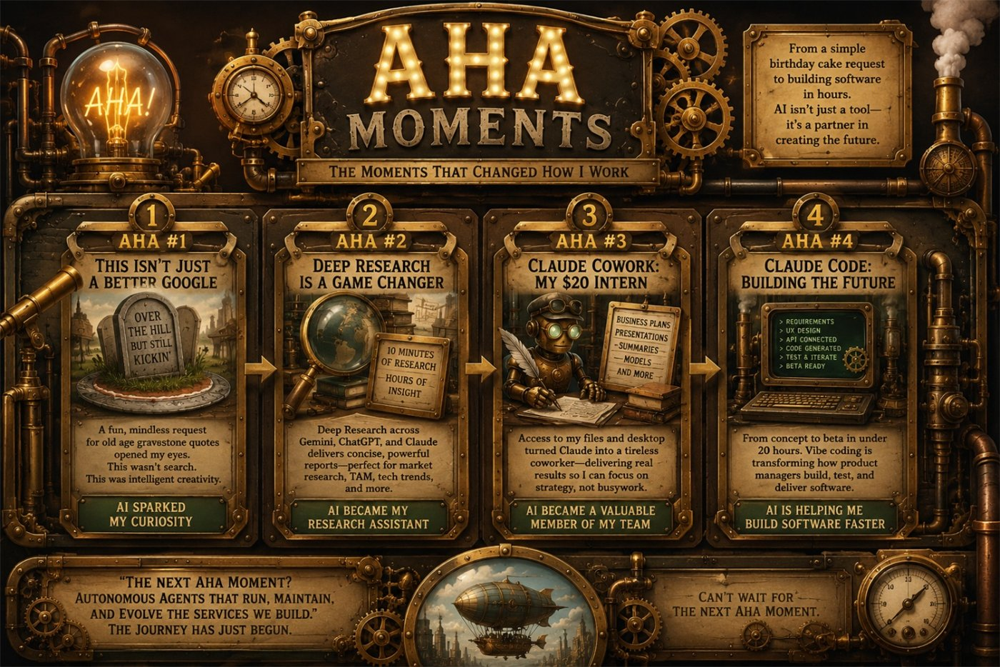

Everyone talks about AI as if it arrived overnight. My experience has been different. It wasn't one giant breakthrough. It was a series of "AHA moments." Each one fundamentally changed how I thought about what AI could do, and more importantly, how I could use it in my daily work.

Looking back, I can identify four moments that completely reshaped my workflow. I'm convinced there are many more to come.

## AHA #1: This Isn't Just a Better Google

Like many people, my first interaction with ChatGPT was anything but serious.

My adult daughter's birthday was coming up, and I wanted a funny "over the hill" birthday cake. I asked ChatGPT to generate humorous gravestone quotes suitable for the cake. It delivered dozens of clever ideas in seconds.

It was a completely trivial task.

But it triggered something.

I realized I wasn't using another search engine. I wasn't typing keywords and sifting through pages of links. I was having a conversation with software that understood what I wanted and created something original.

That was the first time I thought:

*"This isn't just a new Google."*

From that point on, I began experimenting with business tasks.

Writing has never been my favorite part of being a product manager. I usually know exactly what I want to communicate, but getting the first draft started has always been the hardest part.

ChatGPT became my writing partner.

Soon I added Microsoft Copilot and Google Gemini into the mix. Each had different strengths, but together they dramatically reduced the friction of writing:

- Product requirements
- Executive summaries
- Business emails
- Presentation outlines
- Brainstorming sessions
- Documentation

AI didn't replace my thinking.

It eliminated the blank page.

Instead of spending an hour getting started, I spent an hour improving something that already existed.

That was my first productivity breakthrough.

## AHA #2: Deep Research Changed Product Management

The next breakthrough came when I discovered Deep Research.

I needed to learn an unfamiliar technology and noticed a feature inside Gemini called **Deep Research**.

I submitted my topic.

Instead of immediately generating an answer, Gemini spent nearly ten minutes researching the subject from multiple sources before producing a concise, well-structured report.

The result felt less like an AI response and more like receiving a custom white paper written specifically for my question.

That changed everything.

As a product manager, learning quickly is one of the most valuable skills you can develop. Every new market, customer segment, competitor, or technology requires research.

Deep Research became one of my favorite tools.

Whether using Gemini, ChatGPT, or Claude, these research capabilities now help me:

- Estimate Total Addressable Market (TAM)
- Learn emerging technologies
- Compare competitive products
- Understand technical standards
- Gather industry specifications
- Build stronger product requirements

Instead of spending half a day reading dozens of websites, I could begin with a synthesized report and then validate the important details.

AI was no longer simply helping me write documents.

It had become a genuine research assistant.

## AHA #3: Claude Cowork Became My $20 Intern

The third breakthrough came with Claude Cowork.

After granting Claude access to my project files and permission to write documents locally, something changed.

I no longer viewed AI as a chatbot.

I started treating it like an intern.

For roughly $20 per month, I suddenly had someone available 24 hours a day who could take assignments like:

- Build a pro forma business plan.
- Create a PowerPoint presentation for leadership.
- Summarize a lengthy proposal.
- Organize research into executive-ready documents.
- Draft business models.
- Generate planning artifacts.

These weren't toy examples.

These were real deliverables.

Instead of asking AI questions, I started delegating work.

That distinction is important.

The value wasn't that Claude produced perfect outputs. It was that it gave me a high-quality first draft that I could review, refine, and personalize.

Rather than spending hours on the "blocking and tackling" work that every product manager has to complete, I could focus on strategic decisions, customer problems, product direction, and stakeholder communication.

Claude became a productive member of my team.

Not because it replaced people.

Because it amplified what I could accomplish.

## AHA #4: Claude Code Is Changing Product Development

My latest and perhaps biggest AHA moment has been Claude Code.

For years, I've imagined a future where a product manager could define requirements, describe user experiences, and have software built in days instead of months.

That future is beginning to arrive.

Whether people call it "vibe coding," AI-assisted development, or next-generation software engineering, the result is the same:

Small teams can now build software at an incredible pace.

My workflow has already changed.

Instead of delivering spreadsheets and lengthy Product Requirements Documents for engineering teams to interpret, I'm increasingly delivering working user experiences.

I define the UX.

I connect it to APIs.

Claude Code generates much of the implementation.

I test.

I iterate.

Then I refine.

The conversation shifts from abstract requirements to working software.

In my AI workshops, this is now the workflow I demonstrate.

Starting with nothing more than an idea, I can move from concept to a functional beta of a basic software service in under twenty hours.

That process includes:

- Market research
- Business model development
- Product requirements
- UX design
- Working software
- Initial testing
- Business metrics

AI isn't replacing product management.

It's allowing product managers to become product builders.

That is a profound shift.

## Looking Ahead

Every one of these AHA moments expanded my understanding of what AI could do.

First, it helped me write.

Then it helped me research.

Next, it became a coworker.

Now it's helping me build software.

The next stage of my AI evolution is already becoming clear.

I want autonomous AI agents that don't just build software but also monitor, maintain, improve, and operate the services I've created.

Imagine AI agents monitoring customer behavior, identifying issues, updating documentation, proposing new features, and even deploying improvements with appropriate human oversight.

That future feels much closer than I imagined just a year ago.

What's exciting isn't that AI is replacing work.

It's changing the kind of work we get to do.

Every AHA moment has allowed me to spend less time creating documents and more time creating value.

And if the pace of innovation continues, I'm confident this list of four AHA moments won't stay at four for very long.

I can't wait to discover the next one.
