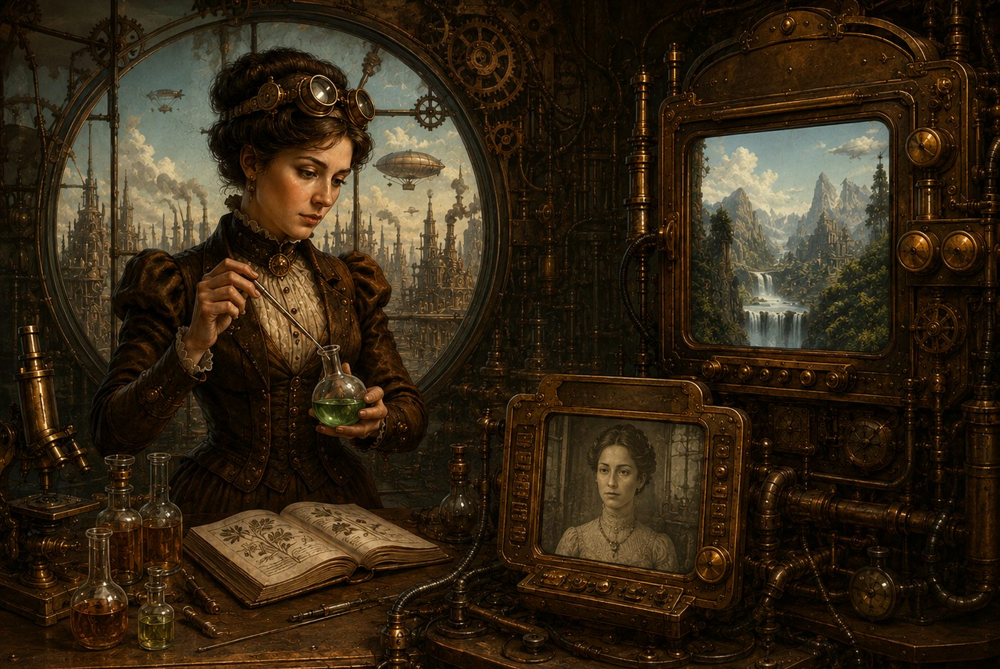

As product managers, we're often asked to answer a deceptively simple question: *What comes next?*

Most people assume that product management is about defining features, prioritizing roadmaps, or writing requirements. While those are certainly part of the job, the most rewarding aspect is imagining how technology changes people, not what technology can do today, but how it quietly becomes woven into everyday life.

That fascination with the future has followed me throughout my career since my time as a student taking my first Optics course, I did a lab with a early prototype digital camera(This was back in the day that the CCD had to be cooled with liquid nitrogen to set the time frame).  After that lab I started to imagine a world where people did not run out of film or run to the photo booth before they closed to grab your double print order.  Ten years later I started to see this new world of digital photography evolve, woven into everyone’s life.  

In this same sense of future technology and society themes, I was fortunate enough to have the opportunity to work with Prof. Steve Mannheimer.  He introduced me to a remarkable book that few people have heard of: *The Diothas, or A Far Look Ahead*. Written in the late nineteenth century, the novel presents a vision of society centuries into the future.  What struck me was not simply the imagination of its author, but how many ideas resemble technologies we now take for granted.

The novel describes devices such as the **Lizzio**, a wall-mounted visual display that is remarkably similar to today's flat-panel televisions, and the **Varzio**, a communication system that closely resembles modern video conferencing. These descriptions were written decades before television, computers, or the internet existed.

Of course, the author did not predict LCD panels, fiber optics, or Zoom meetings. Instead, they imagined the human need behind the technology and the desire to communicate effortlessly across distance and to experience information visually in the home. That distinction is important. Great futurists rarely predict the engineering details correctly. They predict how people will eventually want to live.

That idea has always fascinated me.

Throughout my career, I've been drawn to authors who look beyond gadgets and instead imagine how technology becomes part of society.

Neal Stephenson's *The Diamond Age* introduced the idea of molecular engineering and "Ractors"—interactive performers who blur the line between human creativity and technology. Today, as AI-generated content and digital personalities become commonplace, those ideas feel less like science fiction and more like product roadmaps.

Philip K. Dick's *The Minority Report* imagined personalized advertising, biometric identification, autonomous transportation, and predictive intelligence. While Steven Spielberg's film adaptation popularized retinal scanning and self-driving transportation, the original story explored a much deeper question: how society changes when technology begins making decisions before humans do.

William Gibson's *Neuromancer* practically invented the language of cyberspace. Long before the internet became mainstream, Gibson envisioned people living simultaneously in physical and digital worlds, where identity, commerce, and communication flowed seamlessly between them.

The common thread isn't that these authors accurately predicted specific products. It's that they understood something more valuable: technology succeeds when it becomes invisible. The greatest innovations disappear into daily life until we can't imagine living without them.

That philosophy became one of the inspirations behind **Diothas Systems**.

The name itself reflects this idea of looking ahead, not simply imagining future technology, but imagining how products, services, and people evolve together. Technology never exists in isolation. Every successful product changes behavior, creates new expectations, and becomes the foundation for something entirely new.

As product managers, we often begin by selecting a point somewhere in the future. We imagine a world where a particular problem has already been solved. Then we work backwards, identifying the incremental innovations that move us from today's capabilities toward tomorrow's reality.

In many ways, roadmap planning is an exercise in applied science fiction.

The difference is that our job is to transform imagination into execution.

Today's technology landscape makes that process more exciting than ever.

Artificial Intelligence represents one of those rare inflection points that fundamentally changes how products are conceived and built.  Products are typically part of an cyclical evolutionary cycle where real change happens in in the revolutionary.  Every revolutionary  technology wave, from personal computers to the internet to smartphones, expanded what products could do. AI changes something even more profound: it changes who can build them and how quickly ideas become reality.

For much of my career, product ideas were constrained by engineering capacity and budgets. Product managers imagined possibilities, but implementation depended upon significant technical investment and long development cycles.

AI dramatically lowers those barriers.

Today, ideas can be explored, prototypes can be generated, user experiences can be simulated, and software can be developed at a pace that would have seemed impossible only a few years ago. The bottleneck is shifting away from technology itself and toward imagination, vision, and product thinking.

That's an extraordinary change.

It also reinforces why studying visionary authors remains valuable.

The people who imagined the Lizzio or the Varzio were not engineers. They were observers of humanity. They understood that the future belongs not to those who invent technology first, but to those who recognize how people will eventually embrace it.

That lesson is as relevant for AI as it was for electricity or television.

We're still at the very beginning of AI's evolutionary cycles. Most conversations today focus on models, prompts, benchmarks, and capabilities. Those are important, but history suggests they won't be what matter most in twenty years.

Instead, future generations will remember the products, experiences, and services that made AI feel natural and tools that quietly integrated themselves into work, education, healthcare, entertainment, and everyday life.

Those products have yet to be imagined.

That belief is one of the driving ideas behind the **Diothas Systems Workshop**. The workshop demonstrates how AI can accelerate the journey from an idea to a functioning product or service. Rather than replacing creativity, AI amplifies it, allowing product teams to spend more time exploring possibilities and less time overcoming technical barriers.

In many respects, it feels like we're living through the next chapter of the story that *The Diothas* began over a century ago.

The technologies will continue to change. The interfaces will evolve. Entire industries will emerge and disappear.

But the real challenge remains the same as it was for the novel's author: imagining not simply what technology can do, but how people will live once it becomes part of everyday life.

Looking far ahead has always been the hardest part of innovation.

Fortunately, history reminds us that the future often begins as someone's story.
