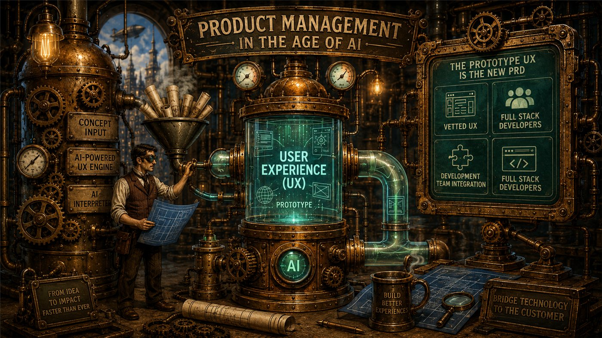

For as long as most of us have been doing this job, product management has always had the challenge to represent the user-desired outcomes while trying to interpret that for a development team that includes designers and software engineers. The Product Manager(PM) has the vision, the idea of how to solve the customer’s issue or create a valued service, but trying to put that into words and detailed business requirements is always the challenge. Every reader has their own interpretation of the words on the page that may not align with the PM. In the age of AI, the PM now has the capability to put the vision and idea into practice with a usable, testable and experiential product user experience.

## The requirement was never the product

Requirements documents were always necessary but suffered from lossy compression. We took a rich, specific, felt idea about how a customer would move through a product, and we squeezed it into bullet points, tables, and shall statements. Then we handed that compressed file to a development team and asked them to decompress it back into the original idea. Every gap in the document became an assumption. Every assumption became a design decision made by someone who was not in the room when the idea was formed and who had no reason to know what was left out.

The result was months of iterative cycles. Draft, review, clarify, revise, estimate, negotiate scope, build, discover the ambiguity at alpha, redesign. We called that process rigor. Much of it was translation loss.

What has changed is that the compression step is no longer necessary. AI tooling lets a PM take an idea and put it into a working, clickable, testable user experience in days. Not a wireframe. Not a slide with arrows. A thing a person can actually use. When you can produce the artifact itself, describing the artifact is no longer the job.

## The user experience is the product

This is the part that some organizations still resist, because it sounds like a land grab to become the primary recipient of resources and budget; it is not. It is an acknowledgment of what customers actually buy.

Customers do not buy the architecture. They do not buy the API design, the database schema, or the elegance of the service mesh. They experience the product through the interface, the flow, the language, the timing, and the moments where the system either anticipates what they need or makes them work for it. That surface is the product. If the PM owns the product, the PM owns the experience and customer outcomes, and now the PM has the means to build it.

So the deliverable changes. The new product requirements document is a complete and vetted user experience. It has the flows, the states, the empty conditions, the error paths, the copy, the transitions. It is handed to the development team not as a description to be interpreted but as a specification to be enabled with real data, real integrations, and real scale. Ambiguity collapses because there is very little left to infer. The question shifts from what did you mean to how do we wire this up.

## Three paths to velocity

Organizations do not have to adopt this all at once. There are several paths through the change, and each one takes time out of the cycle.

In the first, the UX and the service are locked by the AI generated experience at the moment of handoff. The development team leverages the flow as given, hands the prototype to a designer, regenerates the UX elements in whatever tooling the team already uses, and passes it to development. Nothing about the existing process breaks. The team simply starts from a settled experience instead of a contested one.

In the second, the development team takes the UX directly and works backward from it, building the data models and the APIs the service and the experience actually require. The interface stops being the last thing negotiated and becomes the contract the backend is designed to satisfy.

In the third, the PM builds and connects the APIs during the product design phase. At that point there is no translation step left at all. What arrives at engineering and QA is a running service, and the conversation jumps straight to validation, hardening, and scale.

The progression is worth noticing. Each step moves more of the ambiguity out of the schedule and earlier into design. The PRD has become the product. Eventually, all 3 roles overlap their activities into a parallel process where design is providing guidance on the UX that PM is building; at the same time, the data and API requirements become visible so the engineers can begin their design work.

## To build the bridge it still takes the right skill

A PM still has to bridge the technology to the customer, and that bridge is built from two directions at once. Facing the customer, the PM has to genuinely inhabit the experience, not just review it. Use it. Sit down as the installer with cold hands in a basement, the subscriber trying to get a kid's tablet back online at bedtime, the support agent on the third call of the hour. If you cannot narrate the customer's internal monologue while clicking through your own prototype, you have not designed an experience, you have arranged some screens. This is the process I described in [the Spouse Acceptance Factor perspective](/perspectives/saf-stopwatch/).

Facing the technology, the PM has to keep one hand on what is actually happening in the backend. A prototype that assumes data you do not collect, latency you cannot achieve, or a device state you cannot read is not a product requirement. It is a wish. The new tooling makes it easier than ever to build a beautiful, fluent, completely unbuildable experience. Technical competence is what separates a prototype that accelerates a team from one that sends them into a quarter of rework.

That combination, deep customer empathy plus real technical judgment, was always the mark of a good PM. It is now the entire ballgame.

## With great power comes great responsibility

When a PM can produce a working experience in a week, the temptation is to produce something in a week. Throw it over the wall, let the customer reaction sort it out, fix it in the next iteration. That is not agility. That is customer whiplash, and customers remember it longer than they remember any feature you shipped.

Speed is not permission to skip the work. It is an opportunity to do the work earlier. Spend real time inside the interactive prototype. Break your own flows. Run basic customer testing with actual humans, even five of them, even informally. Walk the support and installation paths, not just the happy path. Pressure test the assumptions your prototype quietly made on your behalf. Decide what the final deliverable is before you fall in love with the demo.

The discipline that used to be enforced by the slowness of the process now has to be supplied by the PM. Nothing else will supply it.

## The so what

What used to take months of iterative cycles between PMs and development teams, cycles that still ended with ambiguity surfacing at alpha and forcing redesign, is now largely a product management exercise. And it is the exercise PMs are supposed to be best at: creating the platform that delivers the right outcome for the customer, and bridging technology to experience efficiently.

The math is not subtle. A technically competent PM, a strong full stack developer, and the right support team can take a solution from concept to beta in weeks rather than months. With a well documented set of APIs, that same PM can carry a “PRD” all the way to a launchable, interactive service. I demonstrated this in my workshop project [Air Savvy](/workshop/air-savvy/).

The prototype UX is the new PRD. The development team's job is to enable it, harden it, and scale it. The PM's job is to be certain, before anyone writes a line of production code, that it is the right experience to build.
