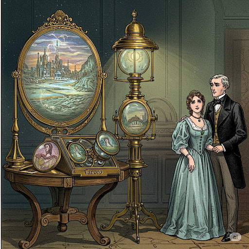

In 1883, a mathematics professor named John Macnie, writing under the pseudonym "Ismar Thiusen," published a novel called *The Diothas; or, A Far Look Ahead*. It's a strange, largely forgotten book today. But strip away the Victorian courtship plot and the awkward pseudo-Latin vocabulary, and what's left is one of the more remarkable exercises in disciplined future-thinking that the era produced. Macnie didn't just imagine a nicer world. He tried to reason forward from the technological trajectories he could already see in 1883, and extrapolate them out ninety-four centuries — an absurd span on paper, but one that let him think in terms of *categories* of technology rather than specific gadgets.

That's the part worth sitting with, especially for a company that has taken this book's name as its own.

## The mechanism: mesmerism as a thought experiment

Macnie's narrator is hypnotized in the nineteenth century and wakes up in the ninety-sixth, guided by a friend named Utis Estai through the transformed city of "Nuiorc" — New York, evolved. The device is transparently a literary convenience, but it's also a discipline: Macnie forces himself to describe an entire functioning civilization, not just a single invention. Transportation, labor, gender roles, language, architecture, communication — all of it has to cohere. That's a harder exercise than predicting one clever device, and it's why the book still gets cited by historians of science fiction and futurism today.

## The predictions that landed

A few of Macnie's guesses are eerily specific. He describes a "calculating machine" used by an elderly astronomer that can draw geometric figures and, run in reverse, derive the formula behind a given curve — a rough sketch of computer-aided geometry and graphing, imagined decades before Turing was born.

He also predicted the automobile with unnerving precision: a general use of horseless carriages capable of roughly twenty miles an hour, faster downhill, complete with a painted line running down the center of the road to organize traffic — a detail so mundane to us that it's easy to miss how genuinely prescient it was to invent lane markings before the vehicles that would need them existed at scale.

And then there's the pairing: **varzeo** and **lizeo** — literally "far-seeing" and "live-seeing" in Macnie's invented future-English. Together they describe what we'd recognize as television and motion pictures: a way to see distant events and living scenes transmitted rather than merely described.

It's not a one-to-one match for a flat-panel display running a FaceTime call, but it's the same underlying leap — that sight itself could be extended electrically, remotely, and in real time. He also worked in the telephone and the phonograph as unremarkable fixtures of daily life, further evidence that he was reading the technological tea leaves of his own decade — Bell's telephone was only seven years old when the book came out — and simply asking, "where does this line keep going?"

## What Macnie actually got right

The specific gadgets are the fun part, but the deeper accuracy is in the *method*. Macnie didn't predict a single miracle device sitting alone in an otherwise-1883 world. He predicted systems: a communications infrastructure, a labor structure reshaped by automation (a three-hour workday, in his telling), and a culture whose values shifted alongside its tools — his future society prizes self-control precisely because its members have gained so much mastery over nature that self-mastery becomes the harder, more important skill.

> Technology doesn't arrive as an isolated object. It arrives as a rearrangement of how people live, work, and relate to each other.

That's the real insight buried in the novel. The people who reason well about the future are the ones modeling the whole system, not just the shiny part.

## Why that matters to Diothas Systems

That's the spirit we borrowed the name for. Diothas Systems isn't in the business of predicting a single product and shipping it once. The bet we're making is the same one Macnie was implicitly making: that if you take the technological threads visible right now — in our case, AI systems that can reason, generate, and act — and follow them forward with discipline rather than hype, you can see the shape of what's coming before it's obvious to everyone else.

Concretely, that means we're not treating AI as a bolt-on feature to whatever we already ship. We're using it the way Macnie used his "calculating machine" and his varzeo — as an infrastructural shift that changes what the rest of the system looks like. AI-assisted design and prototyping compress the distance between an idea and a working version of it. AI-native tooling changes what a small team can credibly attempt. And just as Macnie's imagined society had to rethink labor, education, and daily rhythm once machines took over the tedious work, we think seriously about what our own workflows, org structure, and product roadmap should look like once AI is doing a meaningful share of the analysis, drafting, and iteration that used to consume the bulk of a team's time.

The lesson from a 141-year-old novel isn't "predict specific gadgets and hope you're right." Macnie's calculating machine and varzeo are charming hits, but they're outnumbered by details that never came to pass. The lesson is that *a far look ahead* means committing to the discipline of systems-level thinking about where current trajectories lead — and then building toward that vision deliberately, rather than waiting for the future to arrive and reacting to it. That's the far look Diothas Systems is trying to take with AI: not a single confident prediction, but a continuous practice of extrapolating forward, testing those extrapolations against what's actually emerging, and letting that discipline shape what we build next.
