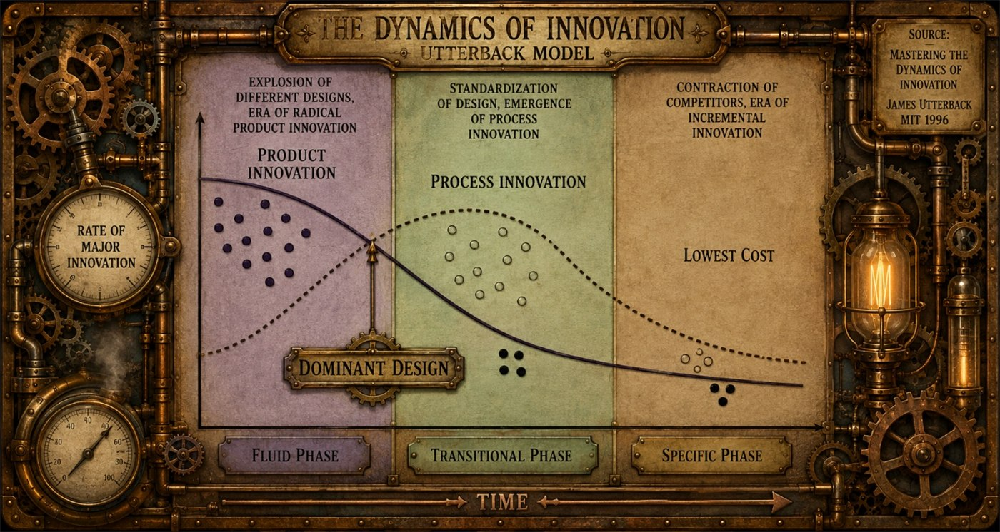

One of the hardest lessons for product managers to learn is that **not every part of a product needs to be reinvented**. Innovation is essential, but innovation for the sake of innovation rarely creates better products. In fact, it often creates worse ones.

Volkswagen seems to understand this. Tesla often doesn't.

Volkswagen recently announced that it is bringing back physical buttons for many core vehicle functions after years of chasing the minimalist, touchscreen-heavy interiors that Tesla popularized. It is an interesting admission because it recognizes something many customers have been saying for years: just because something could be put on a touchscreen doesn't mean it should.

The issue is much bigger than automotive design. It is a lesson about one of the most important concepts in innovation management: **dominant design**.

James Utterback describes this concept brilliantly in [*Mastering the Dynamics of Innovation*](https://www.amazon.com/Mastering-Dynamics-Innovation-James-Utterback/dp/0875847404?crid=2TQP7RJNUJEC8&dib=eyJ2IjoiMSJ9.vQIhD7YoSqlHggnKo65qnUkD2ccQhApfXSrz1V-Ax7piC5LyqkE7wUBY6_7weY8YfenhJZMgjhdGrJyYkl42_bv7QtZQ3JmJoF06Iw_jpS5dxG6HgKATHASAkTrq_DebDoUvWnfi4ni2FjPjoqMyPsHvXVM3L3DJmqK9GqRp_lBwUXKPm1Pd8Jnc--THVdZ7o1i6AqagPG8UFRUuLwnKWzwlriZF8yK6LRqbE7PxWf0.hM0XeMRoI8dcRBnp5wvbgTA3WdumAYUqwEhm6uYHLM8&dib_tag=se&keywords=utterback&qid=1784388601&sprefix=utterback%2Caps%2C272&sr=8-1&linkCode=ll2&tag=diothassystem-20&linkId=632efe4418d2466f91f81fdfe8fdbd31&language=en_US&ref_=as_li_ss_tl). Early in the life of a new product category, companies experiment aggressively. Competing ideas flood the market. Some succeed, most fail. Eventually, one approach proves to be the most effective combination of performance, usability, cost, and customer acceptance. Once that happens, the market converges around a common solution. That solution becomes the dominant design.

After dominant design emerges, innovation changes. Companies stop asking, *"What should this product look like?"* Instead they ask, *"How do we make this version cheaper, better, faster, or more reliable?"*

The classic example is the QWERTY keyboard.

Most people have no idea why the letters are arranged the way they are. It certainly isn't the most intuitive layout, nor is it the fastest. In fact, several alternative layouts, such as Dvorak, have demonstrated higher typing speeds under controlled conditions.

The reason QWERTY exists dates back to the earliest mechanical typewriters. Those machines used metal arms, called typebars, that would physically strike the paper. If commonly used letter combinations were positioned too close together, the typebars could collide and jam when a skilled typist worked too quickly. Christopher Latham Sholes' QWERTY layout spread frequently paired letters apart, reducing jams and allowing typists to work faster with fewer interruptions. During the early stages of typewriter innovation, this was a genuine competitive advantage.

Today's keyboards, of course, have no moving typebars. The original engineering problem disappeared decades ago.

Yet virtually every computer keyboard, laptop, smartphone, and tablet still uses QWERTY.

Why?

Because it became the dominant design.

Once millions of people learned to type, schools began teaching it, businesses standardized on it, and manufacturers adopted it universally. The value shifted from the keyboard layout itself to the enormous ecosystem of users who already understood it.

Imagine if a laptop manufacturer introduced a completely different keyboard layout and expected customers to relearn decades of muscle memory. Even if the new layout were objectively superior, the switching cost would overwhelm the benefit. Customers would simply buy another laptop.

The dominant design has become more valuable than the theoretical improvement.

The automotive industry has countless examples of dominant design as well.

The steering wheel has remained largely unchanged for over a century. Turn signal stalks sit where drivers expect them. Window switches, door handles, pedals, mirrors, and climate controls have evolved incrementally, but their basic operation has become familiar across manufacturers.

Drivers develop muscle memory.

That familiarity has enormous value because it reduces cognitive load while driving.

This is where Tesla made an interesting mistake.

Several years ago, I rented a Tesla for a week because I wanted to understand what all the excitement was about. I was also evaluating whether an electric vehicle would fit my lifestyle.

It was the middle of a brutally hot Georgia summer.

For three days, I couldn't figure out how to point the air-conditioning vents toward my body.

Three days.

Eventually I discovered the solution hidden inside the touchscreen interface. Instead of simply grabbing the vent and adjusting it, I had to navigate through menus and use virtual controls to reposition the airflow.

I remember thinking, **"Why?"**

This problem had already been solved decades ago.

Every car manufacturer in the world had converged on an elegant solution: a small plastic nub attached to the vent.

It costs pennies.

It requires zero training.

You instinctively understand how to use it.

You can adjust it without taking your eyes off the road.

Tesla took a nickel solution and replaced it with a solution that undoubtedly cost significantly more to engineer and software-enable while simultaneously making the user experience worse.

That isn't innovation.

That is innovation for the sake of innovation.

To be clear, Tesla is one of the most innovative companies of the past twenty years. They fundamentally changed public perception of electric vehicles, accelerated battery development, transformed software-defined vehicles, and forced the entire automotive industry to invest in electrification.

None of that is in question.

But even great innovators can not appreciate when a product has a dominant design.

The touchscreen interface became a philosophy rather than a tool. If something could be digitized, Tesla digitized it, even when the existing physical solution was already close to perfect.

The irony is that the arrival of electric vehicles actually did represent the perfect opportunity for meaningful innovation.

Product disruptions create windows where dominant designs have not yet solidified.

When entirely new product categories emerge, customers expect new experiences. Electric vehicles introduced new challenges around charging, battery management, regenerative braking, software updates, route planning, and energy efficiency. These were all opportunities to innovate because customers had no established expectations.

Those are problems worth solving.

Moving air vents onto a touchscreen wasn't.

The same principle applies well beyond automobiles.

Think about smartphones.

Before the iPhone, smartphone interfaces were all over the map. Companies experimented with keyboards, styluses, track balls, resistive touchscreens, navigation wheels, …

Then Apple introduced multi-touch gestures.

Pinch to zoom.

Swipe to scroll.

Tap to select.

Within a remarkably short period, these interactions became the dominant design for smartphone navigation.

Now imagine Google announcing tomorrow that Android users would no longer scroll vertically through content or pinch to zoom into photographs. Instead, they would introduce an entirely new gesture system because it was "more innovative."

Customers would revolt.

Not because the new system couldn't work, but because users already know how smartphones work.

Changing that understanding creates friction instead of value.

The television industry provides another great example.

For decades, the grid guide became the dominant design for navigating live television. Every cable and satellite provider eventually converged on the familiar grid: channels listed vertically, time displayed horizontally, and programs filling the schedule. Once customers learned how to navigate that grid, they could pick up almost any remote control and immediately understand how to find what they wanted to watch.

Companies spent years trying to differentiate themselves. Some redesigned menus, others experimented with different layouts or navigation methods, and many looked for ways to work around intellectual property associated with electronic program guides. Yet despite countless attempts, nobody truly displaced the grid guide because it had become the dominant design. Customers didn't want to relearn television navigation every time they switched providers.

Then the market experienced disruption.

Streaming fundamentally changed how people consumed video. Instead of navigating schedules and channels, viewers searched for content that could be watched immediately. The problem itself had changed.

That disruption created an opening for an entirely new dominant design.

Today, nearly every streaming service presents content as rows of visual tiles, rich artwork, personalized recommendations, and searchable collections. Whether you're using Netflix, Disney+, Prime Video, Max, or Apple TV+, the experience feels remarkably familiar. The interfaces differ in appearance, but they all follow the same underlying navigation model because the market has once again converged on a dominant design.

The lesson is the same. Companies struggled for years to replace the live television grid and failed because customers already understood it. Only when streaming disrupted the product category itself did users become willing to adopt an entirely new way of finding content.

Successful product managers recognize that dominant design creates an invisible contract with customers. Customers don't consciously think about these interactions anymore because they've become second nature.

This is why Volkswagen's decision to restore physical controls is so interesting.

The company appears to have recognized that customers don't want to hunt through menus to adjust the cabin temperature while driving. They don't want to look away from the road to find virtual buttons. They want tactile controls they can locate by feel.

Physical buttons aren't old technology.

They're the dominant design.

The challenge for product managers is figuring out where innovation actually belongs.

Too often, teams become obsessed with making every aspect of a product feel "new." But customers don't buy products because every interaction is unfamiliar. They buy products that solve problems with less effort.

There is an important lesson here for anyone developing products.

**Innovation succeeds when the problem changes.**

That is the essence of dominant design.

Don't waste your innovation budget trying to reinvent something your customers already understand. Focus your creativity where dominant design hasn't yet emerged, or where a genuine product disruption gives customers permission to learn something new.

Electric vehicles were a true disruption.

Battery technology was worth reinventing.

Charging infrastructure was worth reinventing.

Vehicle software was worth reinventing.

Those innovations solved new problems created by an entirely new category of vehicle.

Air-conditioning vents?

Leave the little plastic nub alone.

Volkswagen appears to have recognized this.

The best product managers know the difference between improving a product and changing it simply to appear innovative. The goal isn't to replace every familiar interaction. The goal is to identify where customers actually have a new problem to solve.

Sometimes the most innovative thing you can do is recognize that someone else solved the problem decades ago, and spend your time solving the problems that still haven't been solved.
